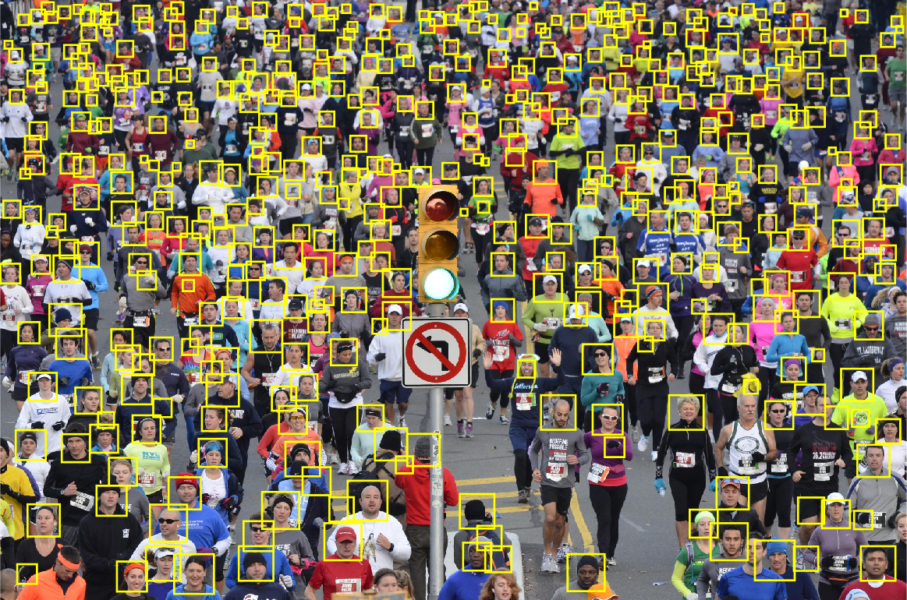

# Efficient Point Process Inference for Large-Scale Object Detection

### Update:
  - Testing using real data (detecting head, birds, cells from images) comming soon!
  - Testing using simulated data: done
### Usage
- Run install.m
- Run demo.m
 
### Citation:
If you use this code, please consider citing the following paper:

    @InProceedings{Pham_2016_CVPR,
    author = {Pham, Trung T. and Hamid Rezatofighi, Seyed and Reid, Ian and Chin, Tat-Jun},
    title = {Efficient Point Process Inference for Large-Scale Object Detection},
    booktitle = {The IEEE Conference on Computer Vision and Pattern Recognition (CVPR)},
    month = {June},
    year = {2016}
    }
	
If you encounter any problems with the code, please contact the first author. Enjoy!